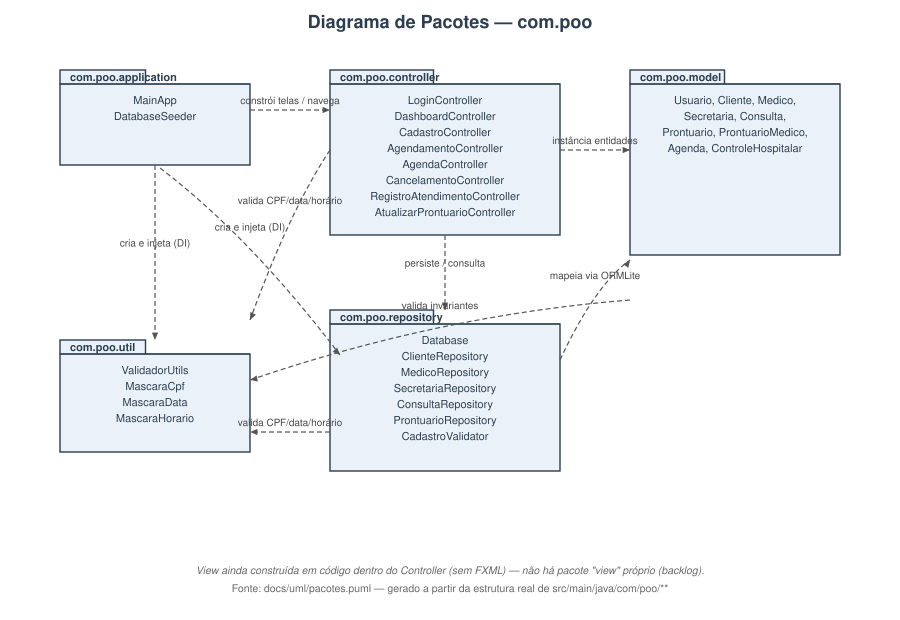
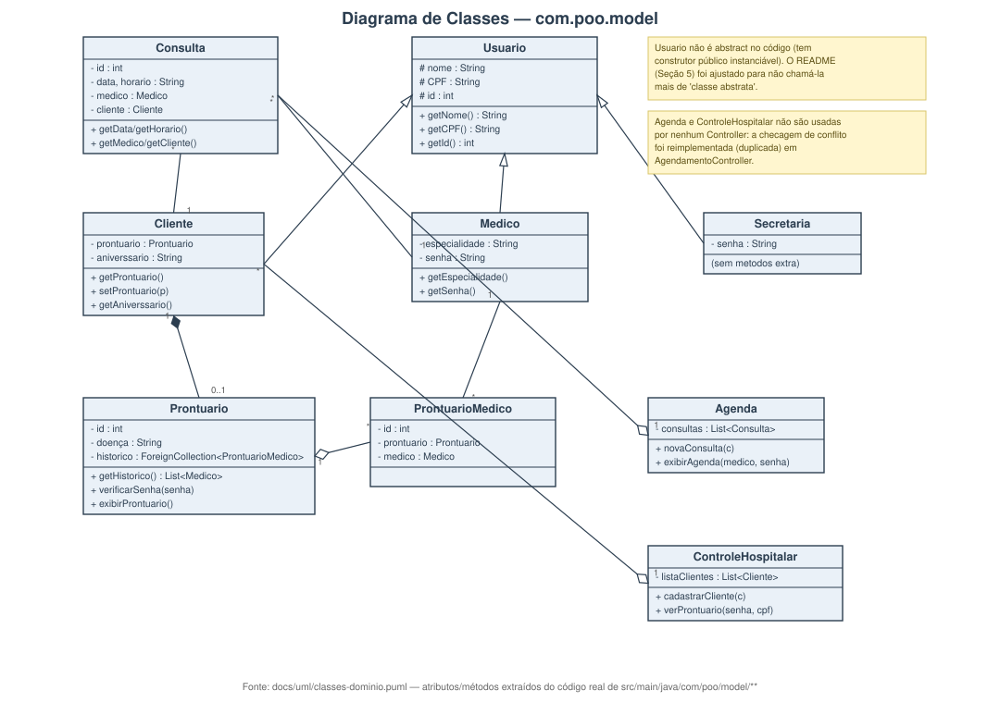
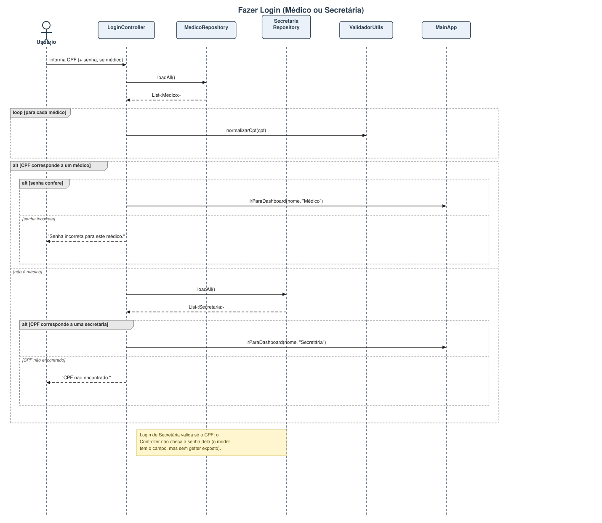
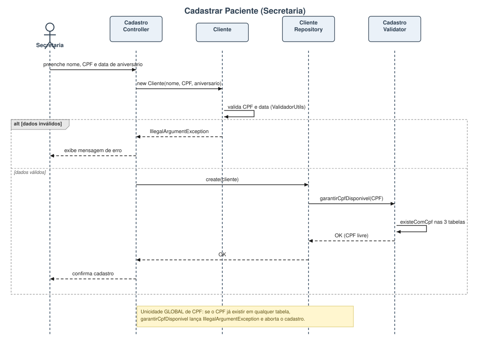
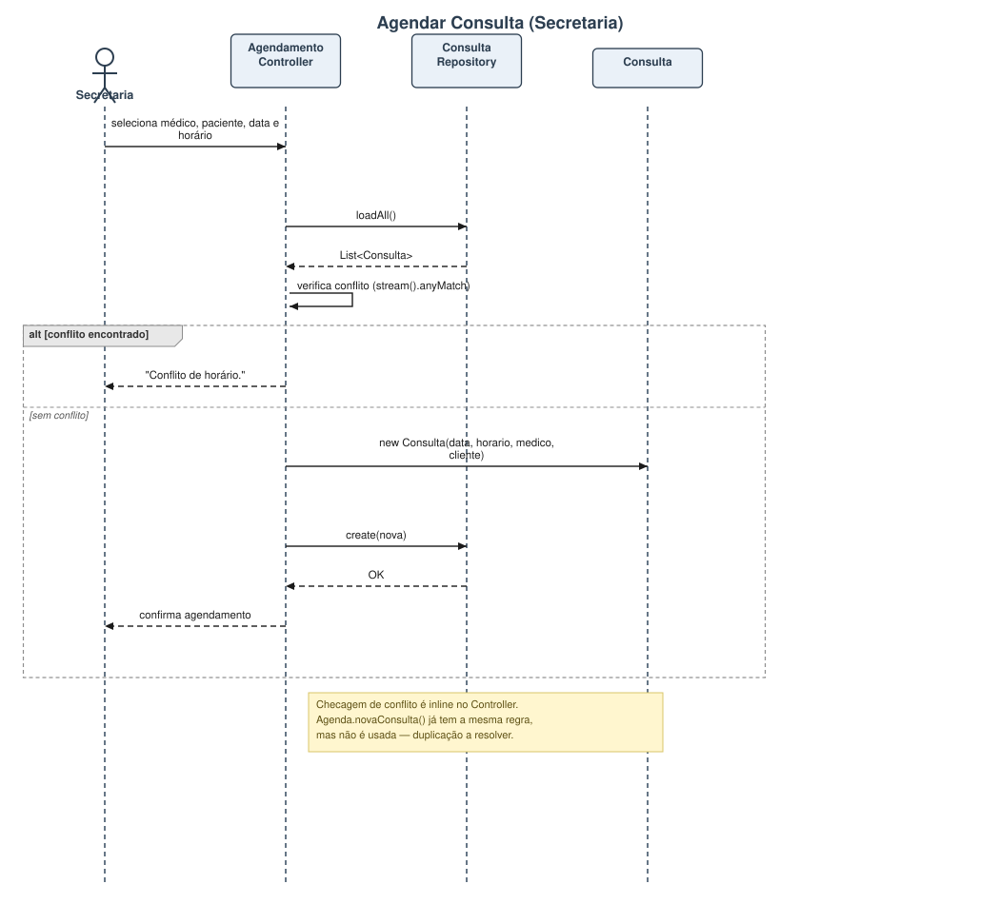
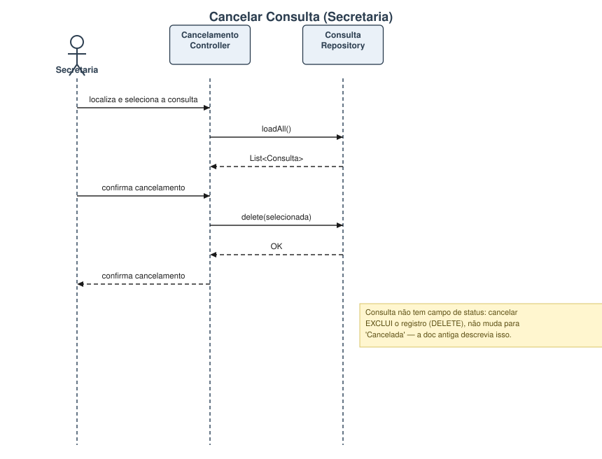
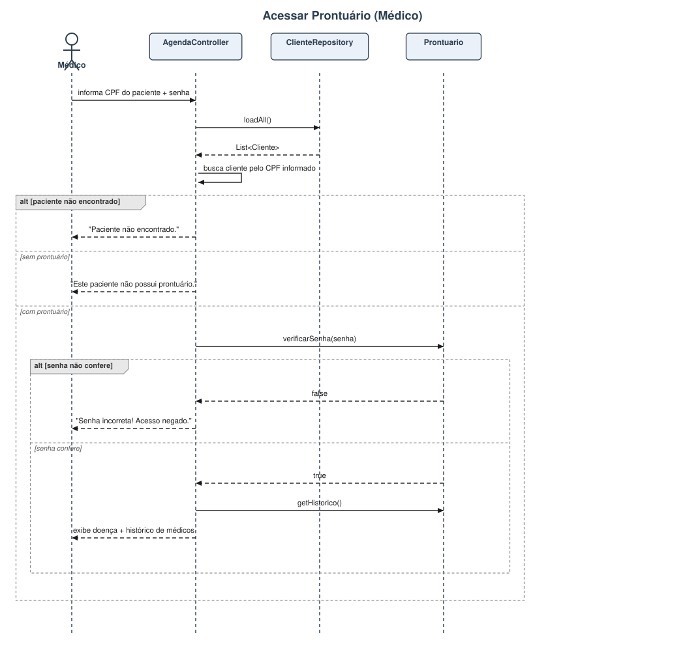
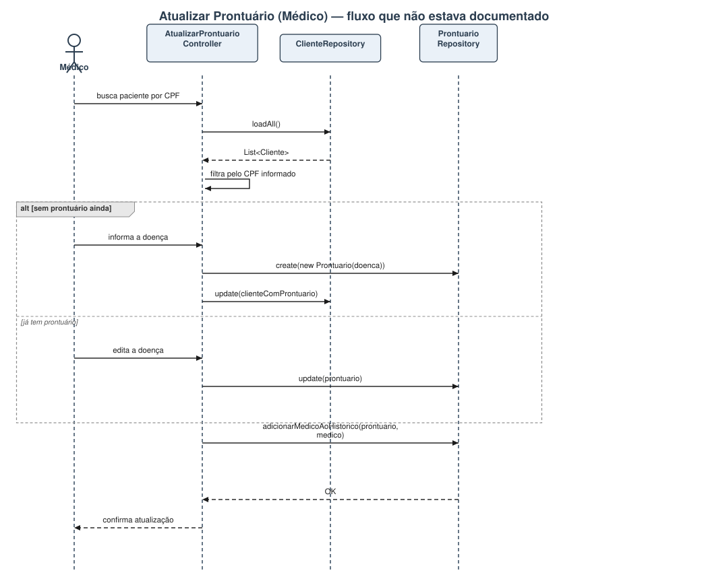
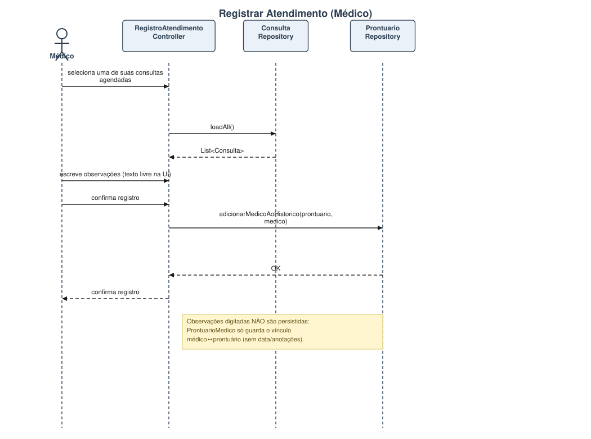
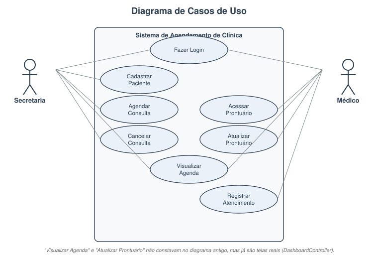

# Sistema de Agendamento Médico — Grupo 8

Repositório do Grupo 8 da disciplina de **Programação Orientada a Objetos (2026/1)**.

---

## 👥 Membros da Equipe

Nome | Função
--- | ---
Alberto Tomaz | Líder do Projeto
Gabriel Fonseca | Backend
Gabriel Mendes | Frontend
Mateus Augusto | Testes
Isabela Campos | Documentação

---

## Seção 1—Introdução

### Justificativa

A gestão de clínicas médicas, especialmente em saúde mental, envolve processos sensíveis e complexos: agendamentos, controle de prontuários, histórico de atendimentos e comunicação entre médicos e secretaria. A ausência de um sistema digital bem estruturado força profissionais a depender de anotações manuais ou ferramentas genéricas que não atendem às especificidades da área.

### Descrição dos propblemso o Problema

Um dos integrantes do grupo possui um familiar que trabalha em uma clínica psiquiátrica e identificou, na prática, a deficiência de um sistema eficiente e eficaz que atenda a tudo que um médico precisa: desde o agendamento de consultas até a organização e o acesso a prontuários eletrônicos completos do paciente.

### Motivação

A proposta deste projeto é desenvolver um sistema de agendamento médico e gestão de prontuários eletrônicos utilizando os princípios da Programação Orientada a Objetos. O objetivo é oferecer uma solução acessível, modular e confiável para clínicas — com foco em saúde mental — que facilite o dia a dia de médicos, secretárias e pacientes.

---

## Seção 2 — Plano

### Objetivo Geral

Desenvolver um sistema back-end em Java para agendamento de consultas médicas e organização de prontuários eletrônicos, utilizando programação orientada a objetos, persistência em banco de dados relacional e boas práticas de arquitetura de software.

### Objetivos Específicos

- Implementar cadastro de clientes (pacientes), médicos e secretárias com autenticação.
- Desenvolver a lógica de agendamento de consultas, impedindo conflitos de horário.
- Criar e manter prontuários eletrônicos por paciente, com histórico de atendimentos.
- Aplicar herança e polimorfismo para representar os diferentes perfis de usuários do sistema.
- Persistir os dados em banco SQLite via ORMLite, com operações CRUD para cada entidade.
- Documentar o sistema com diagramas UML (classes, sequência e casos de uso).

---

## Seção 3 — Divisão de Tarefas

Nome | Responsabilidades
--- | ---
Alberto Tomaz | Coordenação geral, integração dos módulos e revisão de arquitetura
Gabriel Fonseca | Implementação das classes de modelo, repositórios e lógica de negócio
Gabriel Mendes | Desenvolvimento da interface do usuário (JavaFX)
Mateus Augusto | Plano de testes, casos de teste e validação das funcionalidades
Isabela Campos | Documentação, diagramas UML, README e relatórios

---

## Seção 4 — Modelagem

> Cada diagrama tem fonte **PlantUML (`.puml`)** versionada em [`docs/uml/`](docs/uml/) e uma imagem **`.svg`** renderizada a partir dela (gerada localmente, sem depender de URL externa do plantuml.com como antes — o diagrama antigo tinha ficado desatualizado assim que o código foi reorganizado em pacotes). Editem o `.puml` e regenerem o `.svg` quando o código mudar.

### 4.1 Diagrama de Pacotes



Fonte: [`docs/uml/pacotes.puml`](docs/uml/pacotes.puml).

### 4.1.1 Diagrama de Classes de Domínio



Fonte: [`docs/uml/classes-dominio.puml`](docs/uml/classes-dominio.puml) — classes de `com.poo.model` (herança `Usuario`/`Cliente`/`Medico`/`Secretaria`, relacionamentos com `Consulta`, `Prontuario` e `ProntuarioMedico`), com notas sobre `Agenda` e `ControleHospitalar` não estarem mais em uso pelos Controllers.

Para editar: abra o `.puml` no VS Code com a extensão **PlantUML** (`Alt+D`) ou renderize com `plantuml.jar`.

### 4.2 Diagramas de Sequência

Revisados contra o código real dos Controllers (substituem as imagens antigas, que tinham fluxos desatualizados/incorretos).

#### Fazer Login (Médico ou Secretária)



#### Cadastrar Paciente (Secretaria)



#### Agendar Consulta (Secretaria)



#### Cancelar Consulta (Secretaria)



#### Acessar Prontuário (Médico)



#### Atualizar Prontuário (Médico) — fluxo que não estava documentado antes



#### Registrar Atendimento (Médico)



Fontes: [`docs/uml/sequencia-login.puml`](docs/uml/sequencia-login.puml) · [`sequencia-cadastro-paciente.puml`](docs/uml/sequencia-cadastro-paciente.puml) · [`sequencia-agendar-consulta.puml`](docs/uml/sequencia-agendar-consulta.puml) · [`sequencia-cancelar-consulta.puml`](docs/uml/sequencia-cancelar-consulta.puml) · [`sequencia-acessar-prontuario.puml`](docs/uml/sequencia-acessar-prontuario.puml) · [`sequencia-atualizar-prontuario.puml`](docs/uml/sequencia-atualizar-prontuario.puml) · [`sequencia-registrar-atendimento.puml`](docs/uml/sequencia-registrar-atendimento.puml)

### 4.3 Diagrama de Casos de Uso



Fonte: [`docs/uml/casos-de-uso.puml`](docs/uml/casos-de-uso.puml) — reconstruído a partir do `DashboardController` (fonte real de quais telas cada perfil acessa). Inclui **Visualizar Agenda** e **Atualizar Prontuário**, que existem no app mas não constavam no diagrama antigo.

### 4.4 Casos de Uso Detalhados

#### Fazer Login

Campo | Descrição
--- | ---
**Nome** | fazerLogin
**Atores** | Médico, Secretaria
**Descrição** | O usuário acessa o sistema informando CPF e senha.
**Pré-condições** | O usuário possui cadastro ativo no sistema.
**Pós-condições** | O usuário é autenticado e redirecionado ao seu dashboard.
**Fluxo Principal** | 1. O usuário informa CPF e senha. 2. O sistema consulta o repositório correspondente. 3. As credenciais são validadas. 4. O sistema exibe o dashboard do usuário.
**Alternativas** | 3a. Se as credenciais forem inválidas, o sistema exibe mensagem de erro e solicita nova tentativa.

> **Nota de implementação:** o login de Secretária hoje valida só o CPF — o `Controller` não checa a senha dela (o model `Secretaria` tem o campo, mas não expõe getter para isso). Ver `docs/uml/sequencia-login.puml`.

---

#### Cadastrar Paciente

Campo | Descrição
--- | ---
**Nome** | cadastrarPaciente
**Ator** | Secretaria
**Descrição** | A secretaria cadastra um novo paciente no sistema e um prontuário é criado automaticamente.
**Pré-condições** | A secretaria está autenticada.
**Pós-condições** | O paciente é salvo no banco e um prontuário vazio é vinculado a ele.
**Fluxo Principal** | 1. A secretaria preenche nome, CPF e telefone. 2. O sistema valida os dados. 3. Um registro de `Cliente` é criado. 4. Um `Prontuario` é automaticamente criado e vinculado ao cliente. 5. O sistema confirma o cadastro.
**Alternativas** | 2a. Se o CPF já estiver cadastrado, o sistema informa o conflito e cancela a operação.

---

#### Agendar Consulta

Campo | Descrição
--- | ---
**Nome** | agendarConsulta
**Ator** | Secretaria
**Descrição** | A secretaria agenda uma consulta vinculando médico, paciente, data e horário.
**Pré-condições** | A secretaria está autenticada; médico e paciente existem no sistema.
**Pós-condições** | A consulta é salva com status "Agendada".
**Fluxo Principal** | 1. A secretaria seleciona o médico, o paciente, a data e o horário. 2. O sistema verifica conflito de horário para o médico. 3. Não havendo conflito, a consulta é criada e salva. 4. O sistema confirma o agendamento.
**Alternativas** | 2a. Se houver conflito de horário, o sistema informa e solicita novo horário.

---

#### Cancelar Consulta

Campo | Descrição
--- | ---
**Nome** | cancelarConsulta
**Ator** | Secretaria
**Descrição** | A secretaria cancela uma consulta previamente agendada.
**Pré-condições** | A consulta existe e está com status "Agendada".
**Pós-condições** | O registro da consulta é removido; o horário fica disponível.
**Fluxo Principal** | 1. A secretaria localiza a consulta. 2. Confirma o cancelamento. 3. O sistema **exclui** o registro da consulta (`ConsultaRepository.delete`). 4. O sistema confirma a operação.
**Alternativas** | 1a. Se a consulta não for encontrada, o sistema informa o erro.

> **Nota de implementação:** `Consulta` não tem campo de status — não existe transição "Agendada → Cancelada" no modelo atual. Cancelar hoje é um `DELETE` definitivo do registro. Se o grupo quiser manter histórico de cancelamentos, é preciso adicionar um campo de status à entidade (mudança de domínio, exige re-atualizar o UML).

---

#### Visualizar Agenda

Campo | Descrição
--- | ---
**Nome** | visualizarAgenda
**Atores** | Médico, Secretaria
**Descrição** | Lista as consultas agendadas, filtráveis por médico.
**Pré-condições** | O usuário está autenticado.
**Pós-condições** | A tabela de consultas é exibida.
**Fluxo Principal** | 1. O usuário abre a tela de agenda. 2. O sistema carrega médicos e consultas (`MedicoRepository`/`ConsultaRepository`). 3. O usuário filtra por médico, se quiser.
**Alternativas** | —

> Caso de uso que não constava na documentação anterior — existe como tela própria (`AgendaController`), acessível pelos dois perfis no Dashboard.

---

#### Acessar Prontuário

Campo | Descrição
--- | ---
**Nome** | acessarProntuario
**Ator** | Médico
**Descrição** | O médico consulta o prontuário eletrônico de um paciente (aba dentro da tela de Agenda), incluindo histórico de médicos que o atenderam.
**Pré-condições** | O médico está autenticado; o paciente possui prontuário cadastrado.
**Pós-condições** | A doença e o histórico de médicos do prontuário são exibidos.
**Fluxo Principal** | 1. O médico informa o CPF do paciente e uma senha. 2. O sistema busca o paciente (`ClienteRepository`). 3. A senha é validada contra a senha de algum médico do histórico (`Prontuario.verificarSenha`). 4. Se válida, exibe doença + histórico (`Prontuario.getHistorico`).
**Alternativas** | 2a. Paciente não encontrado. 2b. Paciente sem prontuário. 3a. Senha não confere com nenhum médico do histórico.

---

#### Atualizar Prontuário

Campo | Descrição
--- | ---
**Nome** | atualizarProntuario
**Ator** | Médico
**Descrição** | O médico busca um paciente por CPF e cria (se não existir) ou edita o prontuário — e o próprio médico é adicionado ao histórico de atendimentos do paciente.
**Pré-condições** | O médico está autenticado.
**Pós-condições** | O `Prontuario` é criado/atualizado e vinculado ao `Cliente`; o médico logado passa a constar no histórico (`ProntuarioMedico`).
**Fluxo Principal** | 1. O médico busca o paciente por CPF. 2. Se o paciente não tem prontuário, informa a doença e o sistema cria um `Prontuario` novo. 3. Se já existe, o médico edita a doença. 4. O sistema adiciona o médico ao histórico (`ProntuarioRepository.adicionarMedicoAoHistorico`).
**Alternativas** | 1a. Paciente não encontrado.

> Caso de uso que não constava na documentação anterior — existe como tela própria (`AtualizarProntuarioController`), com botão dedicado no Dashboard do Médico.

---

#### Registrar Atendimento

Campo | Descrição
--- | ---
**Nome** | registrarAtendimento
**Ator** | Médico
**Descrição** | Após a consulta, o médico registra anotações clínicas no prontuário do paciente.
**Pré-condições** | O médico está autenticado e acessou o prontuário do paciente.
**Pós-condições** | Um novo registro de `ProntuarioMedico` é adicionado ao histórico do paciente.
**Fluxo Principal** | 1. O médico acessa o prontuário do paciente. 2. Insere as anotações do atendimento. 3. O sistema cria um `ProntuarioMedico` com data, médico e anotações. 4. O sistema confirma o registro.
**Alternativas** | 2a. Se o campo de anotações estiver vazio, o sistema solicita preenchimento antes de salvar.

> **Nota de implementação:** hoje `ProntuarioMedico` só persiste o vínculo médico↔prontuário — não há campos de data/anotações no modelo. As observações digitadas na tela não são salvas; o fluxo acima descreve o comportamento pretendido, não o implementado. Ver `docs/uml/sequencia-registrar-atendimento.puml`.

---

## Seção 5 — Arquitetura e Padrões de Projeto

Para garantir que o sistema seja modular, escalável e de fácil manutenção, foram adotados os seguintes padrões:

- **OOP / Herança e Polimorfismo:** `Cliente`, `Medico` e `Secretaria` estendem `Usuario`, reaproveitando nome/CPF/id e especializando comportamento próprio.
- **Data Access Object (DAO) / Repository:** Camada de persistência isolada da lógica de negócio. Cada entidade possui seu repositório dedicado com operações CRUD.
- **ORM com ORMLite:** Mapeamento objeto-relacional automatizado, lendo metadados das classes Java para criar e gerenciar as tabelas no banco.

### Relacionamentos de Banco de Dados

- **Many-to-One:** `Consulta` possui chave estrangeira para `Medico` e `Cliente`.
- **Many-to-Many:** O histórico de atendimentos é mapeado via tabela pivô `ProntuarioMedico`, usando `ForeignCollectionField` do ORMLite.

---

## Seção 6 — Como Rodar o Projeto

### Pré-requisitos

- Java 17 ou superior
- Maven 3.8+
- VS Code com a extensão **Extension Pack for Java**, ou IntelliJ IDEA

> O banco de dados SQLite é gerenciado automaticamente pelo ORMLite — não é necessário instalar nada separado.

### Passos

**1. Clone o repositório:**
```bash
git clone https://github.com/poo-ec-2026-1/g8.git
cd g8
```

**2. Compile o projeto via Maven:**
```bash
mvn clean install
```

**3. Execute a interface JavaFX:**
```bash
mvn javafx:run
```

Ou, pelo VS Code: abra a pasta do projeto e, com o Maven já tendo baixado as dependências, clique em **Run** acima do método `main` em `MainApp.java` (`src/main/java/com/poo/application/MainApp.java`).

### Observações

- O banco de dados `hospital.db` é criado automaticamente na primeira execução, na raiz do projeto.
- As tabelas são geradas pelo ORMLite com base nas anotações `@DatabaseTable` e `@DatabaseField` das classes de modelo.
- Para reiniciar o banco do zero, basta deletar o arquivo `hospital.db` e executar novamente.

---

## Seção 7 — Estrutura do Projeto

```
g8/
├── src/
│   ├── main/java/com/poo/
│   │   ├── application/
│   │   │   ├── MainApp.java
│   │   │   └── DatabaseSeeder.java
│   │   ├── controller/
│   │   │   ├── LoginController.java
│   │   │   ├── DashboardController.java
│   │   │   ├── CadastroController.java
│   │   │   ├── AgendamentoController.java
│   │   │   ├── AgendaController.java
│   │   │   ├── CancelamentoController.java
│   │   │   ├── RegistroAtendimentoController.java
│   │   │   └── AtualizarProntuarioController.java
│   │   ├── model/
│   │   │   ├── Usuario.java
│   │   │   ├── Cliente.java
│   │   │   ├── Medico.java
│   │   │   ├── Secretaria.java
│   │   │   ├── Consulta.java
│   │   │   ├── Prontuario.java
│   │   │   ├── ProntuarioMedico.java
│   │   │   ├── Agenda.java
│   │   │   └── ControleHospitalar.java
│   │   ├── repository/
│   │   │   ├── Database.java
│   │   │   ├── ClienteRepository.java
│   │   │   ├── MedicoRepository.java
│   │   │   ├── SecretariaRepository.java
│   │   │   ├── ConsultaRepository.java
│   │   │   └── ProntuarioRepository.java
│   │   └── util/
│   │       ├── ValidadorUtils.java
│   │       └── MascaraCpf.java
│   └── test/java/com/poo/
│       ├── controller/   (testes de UI — TestFX)
│       ├── model/
│       └── repository/
├── docs/
│   └── uml/
│       ├── pacotes.puml            + pacotes.svg
│       ├── classes-dominio.puml    + classes-dominio.svg
│       ├── casos-de-uso.puml       + casos-de-uso.svg
│       ├── sequencia-login.puml    + sequencia-login.svg
│       ├── sequencia-cadastro-paciente.puml    + .svg
│       ├── sequencia-agendar-consulta.puml     + .svg
│       ├── sequencia-cancelar-consulta.puml    + .svg
│       ├── sequencia-acessar-prontuario.puml   + .svg
│       ├── sequencia-atualizar-prontuario.puml + .svg
│       └── sequencia-registrar-atendimento.puml + .svg
├── ESTADO_ATUAL.md
├── pom.xml
└── README.md
```

O `mainClass` do `pom.xml` aponta para **`com.poo.application.MainApp`**.

---

## Tecnologias Utilizadas

Tecnologia | Finalidade
--- | ---
Java 17 | Linguagem principal
JavaFX | Interface gráfica
SQLite | Banco de dados local
ORMLite | Mapeamento objeto-relacional
Maven | Gerenciamento de dependências
VS Code / BlueJ | IDEs utilizadas no desenvolvimento
