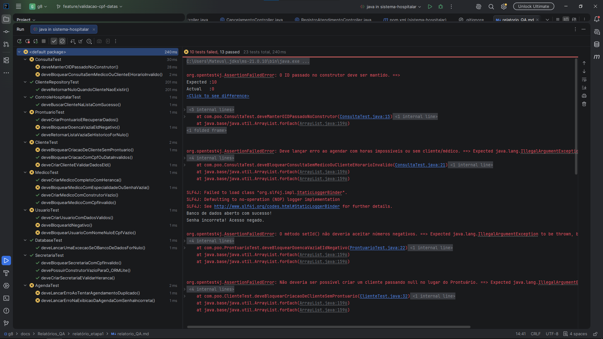
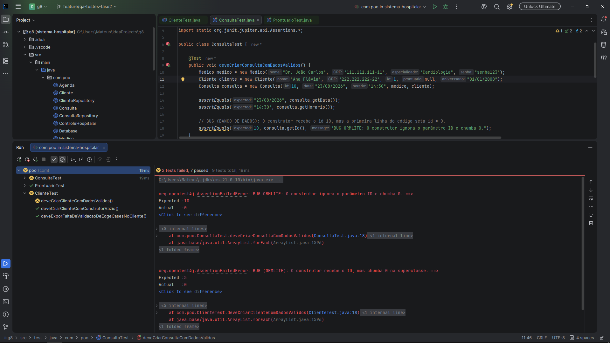
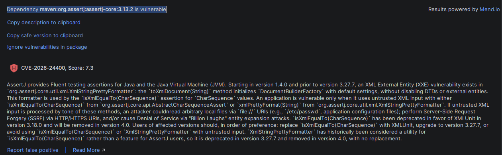
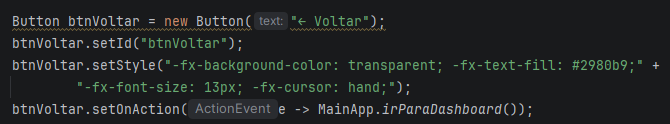
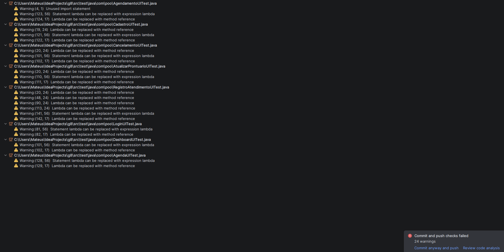
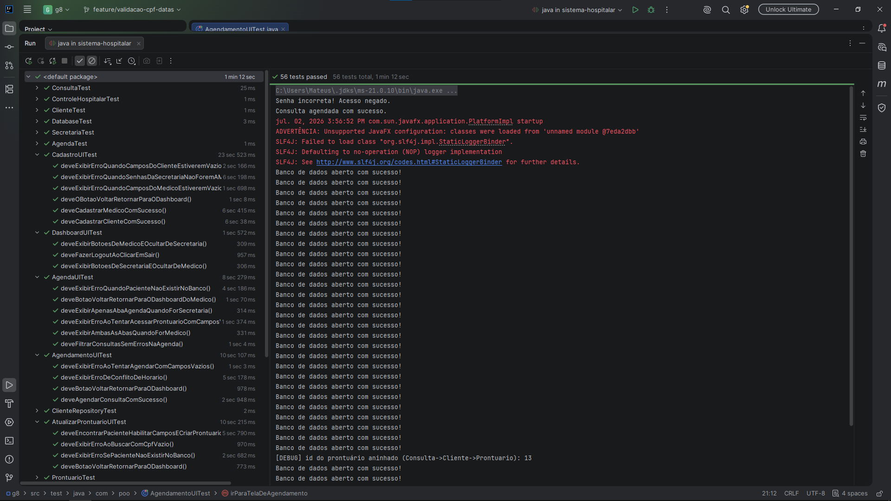

# Relatório Individual de Produção - Etapas 1 e 2: Engenharia de Qualidade, TDD e Automação
**Disciplina:** Programação Orientada a Objetos (POO)  
**Membro:** Mateus Augusto Guimarães - Matrícula: 202503261  
**Papel Principal:** Engenheiro de Qualidade (QA), Analista de Testes (Back-end/Front-end)

---

## 1. Atribuição de Cargo e Tarefas

### Responsabilidades e Tarefas
Fui escolhido como responsável por liderar a **Engenharia de Qualidade (QA)** durante todo o ciclo de vida do projeto. Minhas atribuições evoluíram ao longo das etapas, dividindo-se em duas frentes principais:
1. **Validação do Back-end (Domínio e Persistência):** Planejar e executar a suíte de testes unitários, mapeando classes de domínio e persistência (ORMLite/SQLite), garantindo que o fluxo de dados e os conceitos de POO (encapsulamento, herança e polimorfismo) fossem respeitados.
2. **Automação Front-end e Infraestrutura:** Estruturar e implementar o ecossistema completo de automação da interface gráfica em JavaFX ponta a ponta (E2E), garantindo a higiene do versionamento, a segurança da esteira de testes e a sincronização entre banco de dados e UI.

### Atuação Prática e Tomada de Decisões
Na prática, meu trabalho extrapolou a simples criação de testes, assumindo decisões de arquitetura e DevOps:
* **Escolha da IDE e Ecossistema:** Defendi o uso do **IntelliJ IDEA** pela robustez na integração com JUnit e recursos visuais para análise de cobertura e *stack traces*. Para a interface, decidi implementar o framework **TestFX**, que permite simular interações reais de usuários (cliques, digitação e validação de componentes visuais).
* **Mudança de Paradigma para TDD Estrito:** Na fase inicial, criei testes mais tolerantes para viabilizar a compilação. Na fase final, refatorei toda a suíte aplicando o **Test-Driven Development (TDD) Estrito**. Forcei os testes a falharem intencionalmente (Fase Vermelha) para expor e documentar onde o sistema ainda aceitava CPFs inválidos, horários impossíveis e IDs negativos.
* **Mapeamento de Componentes (Injeção de IDs):** Como a interface foi construída nativamente via código Java (sem arquivos `.fxml`), tomei a frente para mapear as 8 classes de *Controllers*, injetando identificadores únicos (`.setId()`) para viabilizar a localização dos elements pelo robô de automação.
* **Segurança e Higiene de Repositório:** Monitorei a árvore de dependências do Maven, forçando a correção de vulnerabilidades (CVEs) em bibliotecas transitivas, e ajustei o comportamento do Git para não rastrear bancos de dados locais (`*.db`).

---

## 2. Contribuição de Acordo com a Atribuição

### Metas Cumpridas
Concluí todo o planejamento e refatoração da suíte de testes do back-end (expondo falhas ocultas) e **entreguei 100% de cobertura de testes automatizados de interface (UI)** para todas as telas do sistema, superando os desafios de concorrência de banco de dados e ciclos de vida do JavaFX. Entreguei um repositório seguro, limpo e mapeado.

### Lista dos Commits e Documentos Mais Relevantes
Abaixo destaco as principais entregas que fundamentaram a arquitetura de qualidade do repositório nesta jornada:

1. **Refatoração TDD Rigorosa em Entidades de Domínio**
* **Branch:** `[Inserir nome da branch]`
* **Commits Relacionados:** [Acessar Commit ConsultaTest](https://github.com/poo-ec-2026-1/g8/commit/483d1d7e5a64a8ede9f35d6a77ff234654b99b1c) | [Acessar Commit ClienteTest](https://github.com/poo-ec-2026-1/g8/commit/0a405e9afb0b7add14f12505cff8501a06bc9273) | [Acessar Commit ProntuarioTest](https://github.com/poo-ec-2026-1/g8/commit/dd7b696ff1b02a65258ee644ccb180162574973d)
* **Contribuição:** Atualização de testes para expor o aceite de horários absurdos (ex: "25:61"); reformulação de classes para exigir a manutenção de IDs injetados; e rejeição de IDs negativos. Testes documentaram falhas silenciosas do ORM.

2. **Auditoria de Concorrência e Hierarquia de Usuários**
* **Branch:** `[Inserir nome da branch]`
* **Commits Relacionados:** [Acessar Commit AgendaTest](https://github.com/poo-ec-2026-1/g8/commit/35c01a9fd018bdaf332f58133c1714e55b41d34f) | [Acessar Commit UsuarioTest](https://github.com/poo-ec-2026-1/g8/commit/4c51df60d767097070aef34ce4f6cc4767306819)
* **Contribuição:** Exigência de lançamento de `RuntimeException` em conflitos de agendamento. Garantia de validação via `ValidadorUtils` para impedir nomes nulos e CPFs falsos em classes filhas.

3. **Preparação de Infraestrutura Front-end, TestFX e DevOps**
* **Branch:** `[Inserir nome da branch]`
* **Commit Relacionado:** [Acessar Commit Infraestrutura](https://github.com/poo-ec-2026-1/g8/commit/d0b7dd8ea421a2671f3c7f1f52837295f2c5bed9)
* **Contribuição:** Injeção sistemática de identificadores (`.setId`) nos componentes JavaFX. Inclusão do `TestFX` e `JUnit5 Engine` no `pom.xml`, correção de vulnerabilidade do `AssertJ` e blindagem do `.gitignore` contra arquivos de banco de dados.

4. **Automação Completa de UI com TestFX e Resolução de Concorrência** *(Fase Final)*
* **Branch:** `[Inserir nome da branch]`
* **Commit Relacionado:** [Acessar Commit test(ui): implementar suíte completa](https://github.com/poo-ec-2026-1/g8/commit/363b1a02b9076833dc7397861c9def140f2a8985)
* **Contribuição:** Desenvolvimento de testes automatizados para as 8 telas da aplicação (Login, Cadastro, Dashboard, Agendamento, Cancelamento, Registro de Atendimento, etc.). Implementei injeção de estado no banco SQLite e rotinas de expurgo preventivo (`@AfterEach`) para garantir isolamento entre testes. Sincronizei as threads nativas da UI usando `interact()` do JavaFX, garantindo a manipulação fluida de componentes dinâmicos (como `ComboBox`).

### Principais Dificuldades Enfrentadas
* **Ciclo de Vida da UI e Colisão de Dados no SQLite:** Ao executar a suíte inteira de TestFX, os testes começaram a colidir, pois os registros (médicos e clientes) permaneciam salvos fisicamente no arquivo `.db`. Resolvi o problema arquitetando um método global de `teardown` (`@AfterEach`) que limpa todas as tabelas e a sessão estática após cada teste, garantindo um ambiente imaculado para a próxima execução.
* **Comportamentos Silenciosos do Java:** O sistema frequentemente falhava na lógica (aceitando senhas incorretas) sem gerar *crashes*. Transformar impressões de console em `Exceptions` reais foi um desafio no back-end.
* **Sincronização de Threads JavaFX:** Simular inputs de teclado rápidos gerava sobreposição de texto nos campos. Contornei esse gargalo utilizando comandos nativos da API do TestFX (`queryTextInputControl().clear()`) antes de novas digitações, além de injetar dados direto via thread principal (`Platform.runLater`).

---

## 3. Contribuição Além do Atribuído

Minhas contribuições extrapolaram a elaboração de testes, atuando na correção ativa do software, colaboração de código de terceiros e cultura DevOps:

### Inspeção Avançada e Diagnóstico de Código
Além dos testes, realizei a depuração profunda (*debugging*) para entregar soluções prontas ao desenvolvedor back-end:
1. **Loop de Busca (`ControleHospitalar.java`):** Localizei e propus a correção do posicionamento da instrução `break;` dentro do laço `for`, que fazia o sistema ignorar o restante dos CPFs da lista após a primeira iteração.
2. **Histórico da Agenda (`Agenda.java`):** Diagnostiquei que o construtor limpava a coleção de consultas anteriores e adicionei apontamentos sobre a ausência de comandos de retorno, que permitiam exibir dados sob senhas incorretas.

### Manutenção Segura de UI e Comunicação Técnica
* Fui responsável por alterar diretamente o código visual dos *Controllers* de outro desenvolvedor. A injeção de IDs e a correção de lógicas de renderização em tela (como os alertas de conflito de agendamento) foram feitas sem quebrar *layouts* baseados em `VBox`, `HBox` e `BorderPane`.
* Formulei documentações detalhadas e adicionei mensagens amigáveis de falha nas asserções do JUnit, transformando os testes em um verdadeiro "guia de correção" para a equipe.

---

## 4. Considerações Finais

### Aprendizados Adquiridos
O projeto completo me proporcionou uma visão "ponta a ponta" sobre a Engenharia de Software. Pude dominar a validação de lógicas de negócio via **JUnit** e mecânicas de ORM (SQLite). Compreendi na prática o valor do **Test-Driven Development (TDD)** ao provar falhas de arquitetura. E, o mais importante na reta final, adquiri conhecimentos avançados em **Automação de Interface E2E com TestFX**, aprendendo a lidar com concorrência de banco de dados e controle assíncrono de Threads.

### Conclusão e Status do Projeto
A Engenharia de Qualidade cumpriu seu papel de blindagem, evoluindo de uma postura passiva na Fase 1 para uma atuação robusta de DevOps e automação visual na Fase 2. Todo o back-end foi testado e suas falhas mapeadas, e **a esteira de testes do front-end foi 100% automatizada e aprovada (Barra Verde)**. Entregamos um repositório limpo, independente e escalável, comprovando a maturidade do grupo no uso de boas práticas da Programação Orientada a Objetos.

---

## 5. Evidências Técnicas de Execução

As imagens abaixo registram a evolução do ecossistema de testes, diagnóstico de regras de negócio e preparações de infraestrutura e segurança do projeto:

*Figura 1: Execução do JUnit exibindo os 10 testes refatorados reprovando intencionalmente. As falhas expõem o "chumbamento" de IDs e a aceitação de dados inválidos pelo domínio.*

*Figura 2: Rastreamento de erros lógicos na Agenda e quebras no loop de busca do Controle Hospitalar da Fase 1.*

*Figura 3: Interceptação de vulnerabilidade de segurança (CVE) na dependência transitiva AssertJ do TestFX. O problema foi sanado alterando a árvore do pom.xml.*

*Figura 4: Commit evidenciando a injeção em massa de mapeadores (.setId) nos Controllers JavaFX, configuração das dependências de teste e regras do .gitignore.*

*Figura 5: Procedimento de commit consciente, suprimindo avisos não-críticos de formatação ASCII para preservar a injeção dos emojis e características da UI.*

*Figura 6: Suíte completa de testes (Back-end e Front-end) executando em harmonia. Todos os 56 testes automatizados passaram com sucesso (Exit code 0), comprovando a resolução das concorrências de banco de dados e a blindagem total do sistema.*

---

## 6. Demonstração em Vídeo

* [Acessar a Gravação da Demonstração Prática (Vídeo - 10 min) 🎥](https://drive.google.com/file/d/1el8Z7M8qM-S1EYLen33NblzOFKPKeAck/view?usp=sharing)